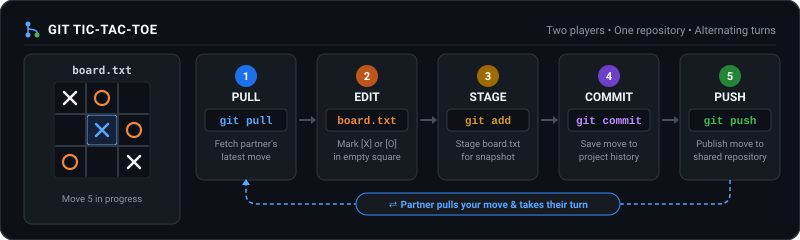

# Git Tic-Tac-Toe Template

A paired collaboration game. You and your partner play tic-tac-toe by committing and pushing moves to a shared GitHub repository.



---

## Initial Setup

Decide who is **Player X** (first mover) and who is **Player O** (collaborator).

### Player X (Host / First Mover)

1. Click **Use this template** > **Create a new repository**.
2. Go to **Settings** > **Collaborators** > **Add people**, and invite **Player O** by their GitHub handle.
3. [Register your game](https://github.com/igorsdub/git-tic-tac-toe-workshop/issues/new?template=register-game.yml) to display your board on the workshop Game Wall.
4. Clone the repository locally:
   ```bash
   git clone <your-repo-url>
   cd <repo-folder>
   ```
5. You are ready to make Move 1!

### Player O (Collaborator / Second Mover)

1. Accept the invitation via email or [GitHub notifications](https://github.com/notifications).
2. Clone the repository locally:
   ```bash
   git clone <repo-url>
   cd <repo-folder>
   ```
3. Wait for Player X to push Move 1. Once they tell you *"Your turn!"*, begin your turn cycle.

---

## The Turn Cycle

Every turn follows these five steps in exact order. **Always pull before editing!**

### 1. PULL the latest move
```bash
git pull origin main
```

### 2. EDIT `board.txt`
Open `board.txt` in your text editor. Replace **one** empty square (`[ ]`) with your mark (`[X]` or `[O]`), then save the file.

### 3. STAGE your change
Verify your diff and stage `board.txt`:
```bash
git status
git diff
git add board.txt
```

### 4. COMMIT with a clear message
```bash
git commit -m "Move 1: X in center square"
```

### 5. PUSH to GitHub
```bash
git push origin main
```
Tell your partner: **"Your turn!"**

---

## Troubleshooting

- **Push Rejected (`[rejected] main -> main (fetch first)`)**:
  Your partner pushed before you fetched. Run:
  ```bash
  git pull origin main
  git push origin main
  ```

- **Merge Conflict in `board.txt`**:
  Open `board.txt`, resolve the conflict markers (`<<<<<<<`, `=======`, `>>>>>>>`), save, and run:
  ```bash
  git add board.txt
  git commit -m "Resolve merge conflict in board.txt"
  git push origin main
  ```

- **Mistake or Typo**:
  Never force push (`git push -f`). Simply fix `board.txt`, commit the fix, and push:
  ```bash
  git commit -am "Fix: correct square"
  git push origin main
  ```

---

## Branch Rematch (Optional)

Finished your match early? Play a rematch on a dedicated branch to keep your first game history intact on `main`:

1. **Player X** creates and pushes the branch:
   ```bash
   git checkout -b rematch
   git push -u origin rematch
   ```

2. **Player O** fetches and switches to the branch:
   ```bash
   git fetch origin
   git checkout rematch
   ```

3. Reset `board.txt` back to empty squares (`[ ]`), commit, and push:
   ```bash
   git commit -am "Start Rematch Game 2"
   git push origin rematch
   ```
4. Play your rematch on the `rematch` branch!
